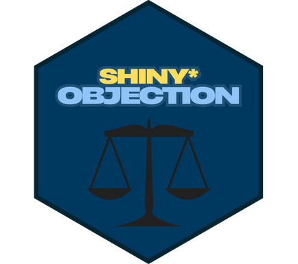

<h3 align="center">
Shiny Objection
</h3>

Can you win the case & defend your client?   <a href=""><strong>Explore the docs »</strong></a>   ·

Welcome to Shiny Objection, the legal drama game where you take on the role of a courtroom superstar! Throw objections, win cases, and have fun in this open-source simulation. 🚀

⚠️ Note: This project is still under development. There’s plenty more to come, and we’d love your help! 🎮

### How You Can Help 🤝

Excited to have contributions from the community. Whether it’s fixing bugs, adding new features, or suggesting improvements, always welcome!

### How to Contribute: Fork this repo 🍴

-   Create a new branch 🌱
-   Work on your changes ✨
-   Submit a pull request 📨
